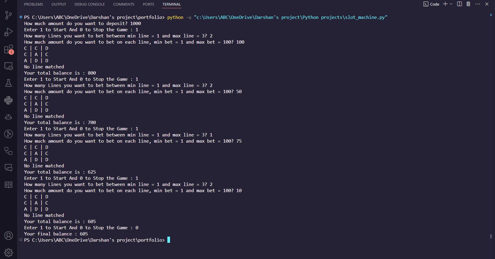

# Slot Machine Game

This Python script simulates a simple slot machine game where players can bet on multiple lines and win rewards based on matching symbols. The game includes functionalities for depositing money, setting bets, spinning the slot machine, and calculating rewards. Four symbols ('A', 'B', 'C', 'D') are defined with associated probabilities and values. Here’s a breakdown of how each component works:
## Components:
1. Deposit Functionality:
- Allows the player to deposit an initial amount of money to start the game.
2. Setting Number of Lines to Bet:
- Players choose how many lines (rows) they want to bet on, with limits set between 1 to 3 lines.
3. Setting Bet Amount:
- Players specify the amount they want to bet on each line, ensuring it falls between a minimum and maximum bet range.
4. Slot Machine Spin:
- Randomly generates a grid of symbols based on predefined symbol weights. Each spin provides a matrix of symbols displayed transversely.
5. Checking for Matches:
- Determines if any lines in the grid match completely and identifies the matched symbols.
6. Calculating Rewards:
- Calculates the total reward based on matched symbols and the player’s bet amount.
7. Game Loop:
- Continuously prompts the player to start a new game round or stop playing, adjusting the player's balance accordingly after each round.

## How to run
- Ensrue you have Python installed on your system.
- Clone this with by running following command:
  ```
  git clone https://github.com/darshanC07/Slot-Machine.git
  ```
  - Run the python file
  ```
  python slot_machine.py
  ```

## Feedback

If you have any feedback, please reach out to me at darshanchoudhary2007@gmail.com
